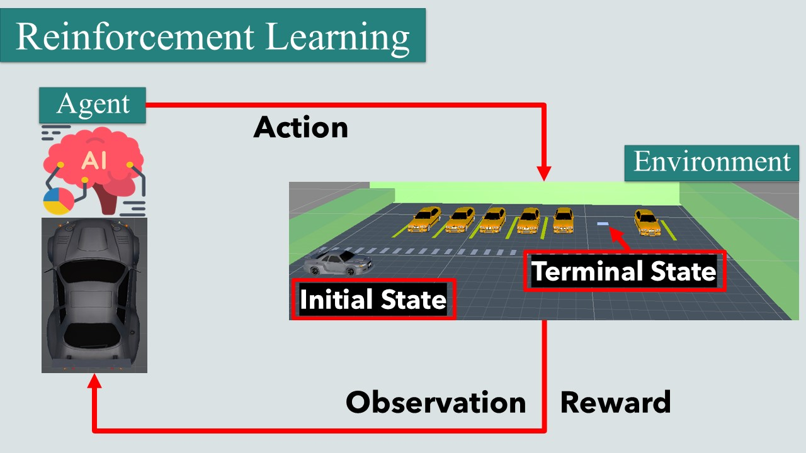
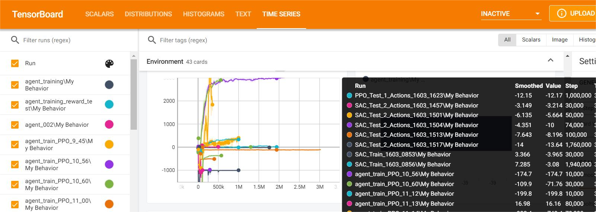

# AI-Driven Continuous Steering Control for Autonomous Parking
## Deep Reinforcement Learning Algorithms SAC, PPO & TD3

A research-oriented implementation of deep reinforcement learning (RL) agents for precise, continuous steering control in fixed-slot autonomous parking.

## 🔍 Overview

This work introduces a novel framework called RARLAP (Reward-Augmented Reinforcement Learning for Autonomous Parking), developed to address the highly constrained and precision-critical task of autonomous vehicle parking. Parking is unlike other autonomous driving challenges—it requires fine-grained steering control, tight spatial awareness, and real-time adaptation to complex environments. Traditional rule-based or purely supervised methods often fall short in handling the dynamic, continuous control requirements of real-world parking scenarios.

## 🚧 Research in Progress

- **Manuscript Under Preparation**  
  A detailed study comparing Proximal Policy Optimization (PPO) and Soft Actor-Critic (SAC)—evaluating convergence speed, success rates, and trajectory smoothness—will be published soon.  
- **Core Code Available**  
  - Unity 3D environment setup  
  - Continuous-action SAC and PPO agents  
  - Custom reward function balancing collision avoidance, efficiency, and alignment  

## ⚙️ What’s Expected

- **Simulation**: Unity 3D car dynamics with steering constraints (Markov Decision Process)  
- **Agents**: Modular SAC and PPO implementations in ML-Agents
- **Metrics**: Scripts for logging success rate, convergence curves, and policy stability  

## 📦 Getting Started

1. Clone this repo and enter the directory:  
   ```bash
   git clone https://github.com/eagle-Ji/AI-based-car-parking-using-reinforcement-learning



