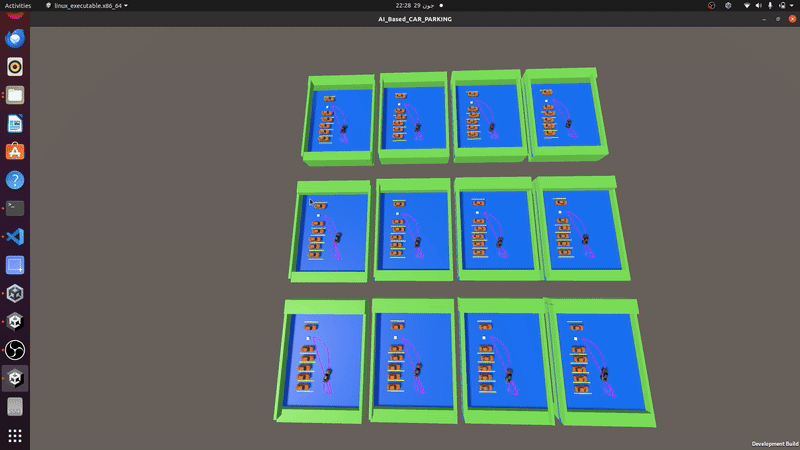

# Reward-Augmented Reinforcement Learning for Continuous Control in Precision Autonomous Parking via Policy Optimization Methods

## Overview

A high‐fidelity Unity‑based framework implementing reward‑augmented learning strategies for continuous‑control autonomous parking (AP). RARLAP enables rapid, safe, and adaptable policy optimization in tight spatial environments by structuring reward functions to guide exploration and convergence.

---
## Key Features

- 🧠 **Reward-Augmented RL**: Supports sparse, dense, and milestone-based reward shaping strategies to guide training behavior in complex parking scenarios.
- 🎮 **Unity 3D Simulation**: High-fidelity simulation environment with realistic physics, Ackermann steering, and customizable parking configurations.
- 🔄 **Continuous Control**: Designed for continuous action spaces, suitable for real-world precision steering tasks.
- ⚙️ **ML-Agents Integration**: Fully compatible with Unity ML-Agents Toolkit for seamless agent training and evaluation.
- 📉 **Benchmark comparisons** highlight RARLAP’s superior convergence speed and safety margins over baseline controllers.
- 📂 **Modular & Extensible**: Codebase structured for easy extension, benchmarking, and integration with new algorithms or tasks.

---

## Project Strcture
- Project Files: contain the Prefeb for Unity Simulation
- Related scripts are provided in the scripts folder
- Pretrained weights for SAC and PPO along with training configuations are given with filenames SAC_MBR and PPO_MBR respectively.

## Cite 
@misc{suleman2025rewardaugmentedreinforcementlearningcontinuous,
      title={Reward-Augmented Reinforcement Learning for Continuous Control in Precision Autonomous Parking via Policy Optimization Methods}, 
      author={Ahmad Suleman and Misha Urooj Khan and Zeeshan Kaleem and Ali H. Alenezi and Iqra Shabbir Sinem Coleri and Chau Yuen},
      year={2025},
      eprint={2507.19642},
      archivePrefix={arXiv},
      primaryClass={cs.RO},
      url={https://arxiv.org/abs/2507.19642}, 
}
  
